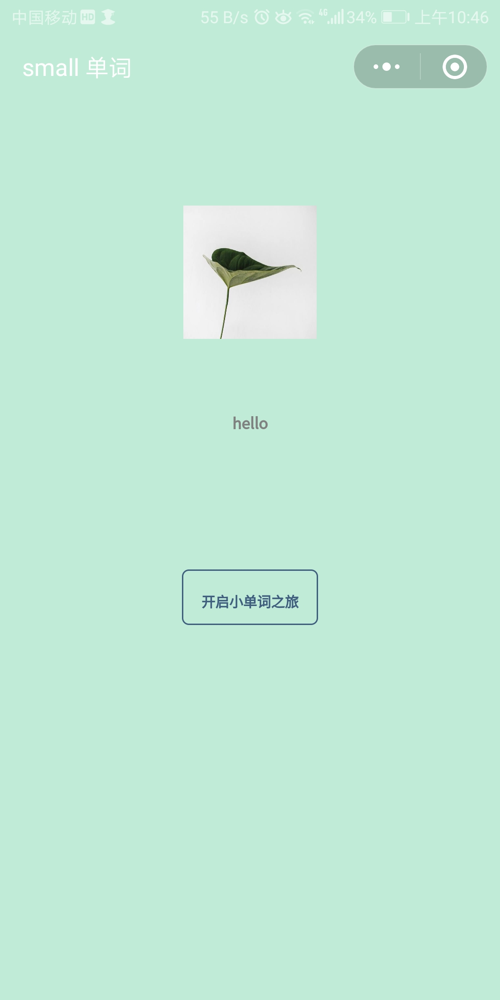
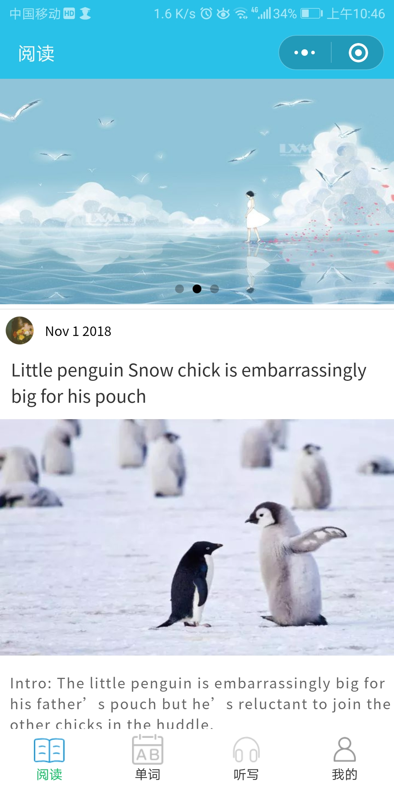
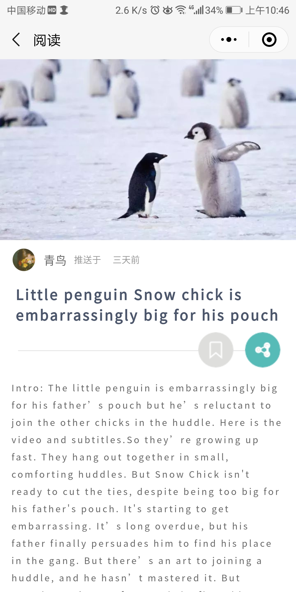
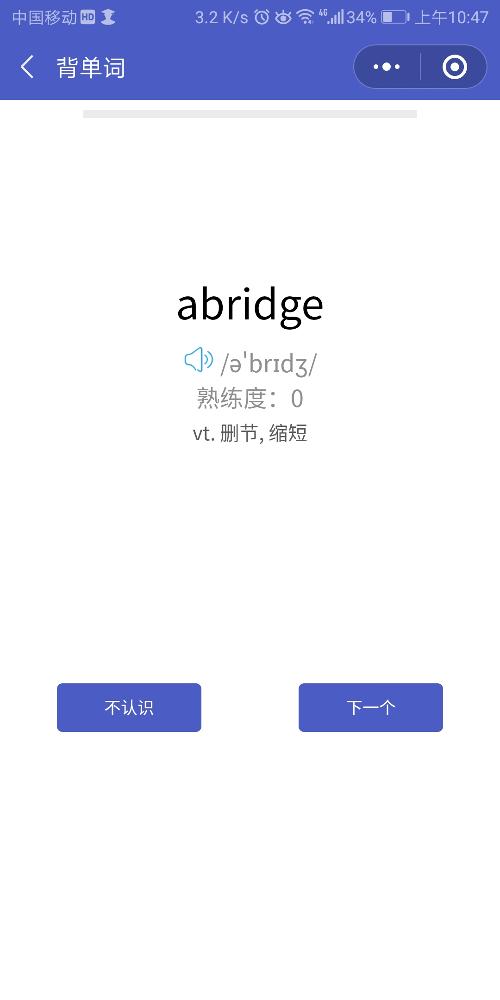
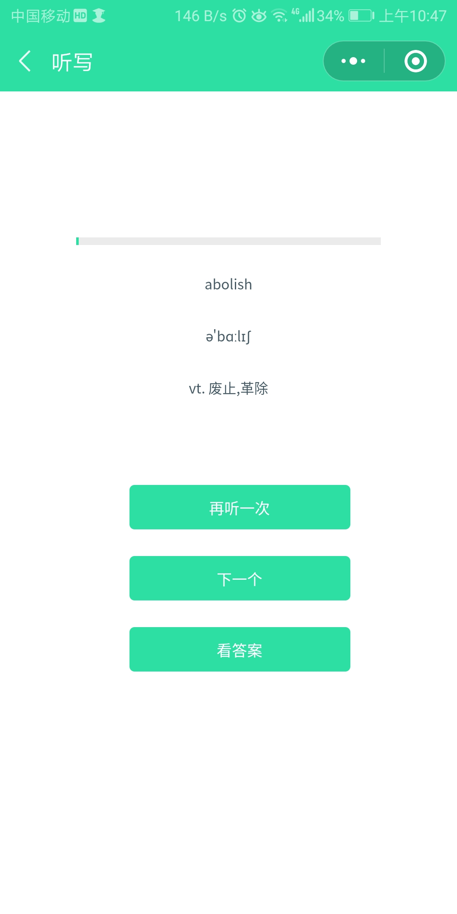
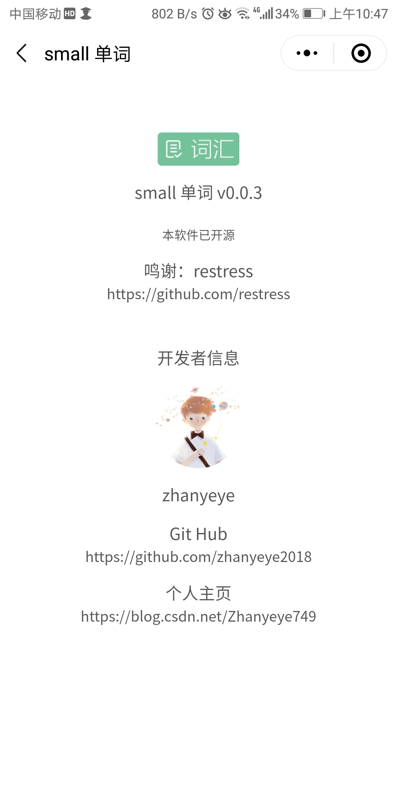
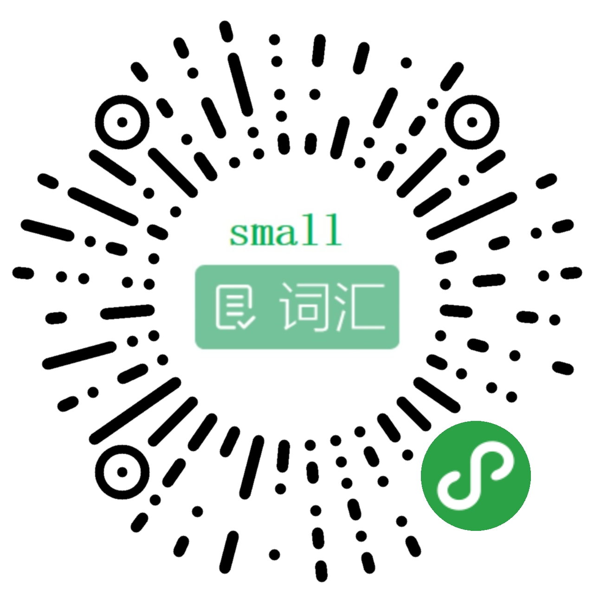

# small 单词

- 背单词和听写部分 设计思路、页面样式 来自了 restress 的[BallBall-Words](https://github.com/restress/BallBall-Words) 这个项目 
- 参考的部分js逻辑重写，js逻辑更合理、可读性更好、使用了扇贝api
- 改进了单词熟悉读的判断
- 使用微信小程序云开发
## 功能
- 阅读
- 背单词
- 听写

## 小记
- restress 的[BallBall-Words](https://github.com/restress/BallBall-Words) 这个项目在我被失败感笼罩时给了我很大的帮助，策划真的很棒，特别是听写这个功能!!!
- 后来觉得 BallBall-Words 的js 代码太复杂（可能是我没看懂作者的思路），干脆自己重新写，感觉自己的更好  哈哈哈 (^~^)

## 效果

